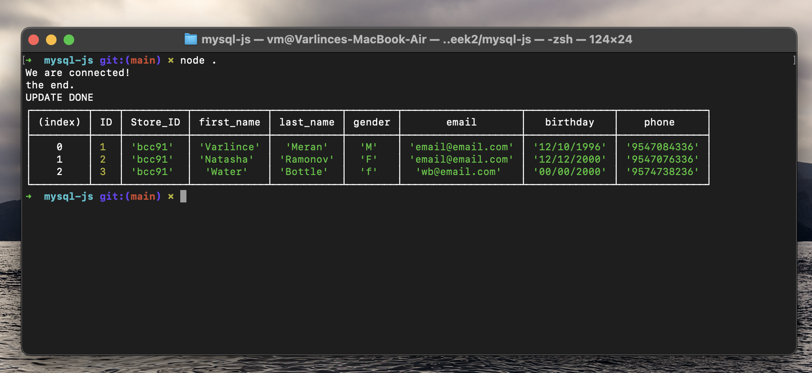

# MySQL with JavaScript
Week 2, Day 2. Connecting MySQL with JavaScript using Node.

## Lesson Learned
1. Node
2. NPM
3. MySQL
4. Secrets

[See the repo](https://github.com/mvarlince/Connecting-to-DB-with-JS).

